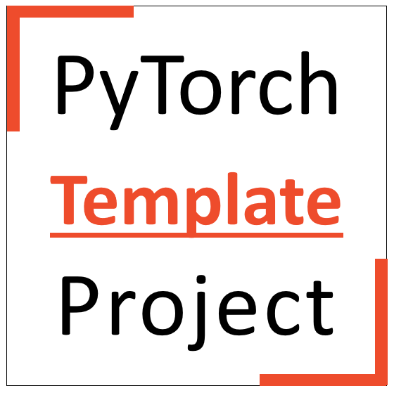
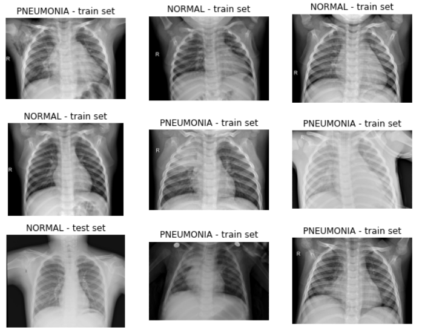

<div align='center'>



[](./LICENSE) [](https://hits.seeyoufarm.com) <br>  

***
</div>

**Table of Contents:**
<!-- TOC -->
- [:scroll:Description](#scrolldescription)
- [:rocket:How to Use](#rockethow-to-use)
- [:open_file_folder:File and Folder Organization](#open_file_folderfile-and-folder-organization)
- [:bar_chart:Project-level Routines](#bar_chartproject-level-routines)
- [:memo:Code-level Routines](#memocode-level-routines)
- [:sparkles:Implemented Features](#sparklesimplemented-features)
- [:clapper:Credits](#clappercredits)
- [:handshake:How to Contribute](#handshakehow-to-contribute)
- [:copyright:License](#copyrightlicense)

<!-- /TOC -->

### :scroll:Description

This repository is intended to be a template for starting new projects with PyTorch, in which deep learning models are trained and evaluated on medical imaging data. The ultimate goal of developing this repository is that it can be cloned and easily used as the starting point for a new project with slight modification to its codes. There should be no more need to rewrite frequently used and overlapping codes (e.g, the codes for configuring training loops, inference, or standard utilities) each time we start a new project. 

As a template, the current reposiotry contains codes to train and evaluate a simple demo classifier for differentiating normal chest Xrays (CXRs) from CXRs for patients with pneumonia. However, this is only a simple demo task, and the current scripts need to be slightly modified for adopting to a new project.

- Note 1: This repository is originally targeted for *personal use*. Although we try to keep it functional, up-to-date, and as organized as possible, **please use this template at your own risk**. <br>

- Note 2: A motivation to develop this repository was to have template codes for a deep learning project that are only based on vanilla PyTorch, and not on any high-level deep learning frameworks like PyTorch Lightning or FasAI which are built on top of PyTorch. Although those high-level frameworks are valuable from different stand points, we aimed to achieve more control over our code, by developing different features from scratch and with easy-to-understand implementation. This inevitably was a trade-off and had the cost of making our codes look occasionally longer than they could be if using high-level frameworks. <br>

- Note 3: Our training pipeline is able to support both single- and multiple-GPU training, using both **Data-Parallel (DP)** and **Distributed Data-Parallel (DDP)** modes. <br>

- Note 4:  Parts of our implementations and codes are adopted from scripts already existing on the web. We have mentioned the links to these resource in the Credits section of the current text. <br>

- Note 5: The data used for this demo comes from a public dataset of chest Xrays that is not pushed to the GitHub repository for being slightly heavy, but one can easily donwload it using the ```data_handling.ipynb``` notebook or [this link](https://data.mendeley.com/public-files/datasets/rscbjbr9sj/files/f12eaf6d-6023-432f-acc9-80c9d7393433/file_downloaded). An example batch of CXRs used in this project looks as follows:<br><br>


### :rocket:How to Use

Start by clonning this repository in your local project's folder, and then simply replace your own data and code modifications with the existing implementations. Try to stick to the file and folder organization, project-level routines, and code-level routines of the current repository, as explained below.

### :open_file_folder:File and Folder Organization

Our codes are organized based on the following hierarchy of files and folders, which we also propose as a baseline for every new deep learning project that will be based on our template repository. Please note that in the following lines, folders are tagged with the red color, notebooks are tagged with the blue color, python files are tagged with the green color, and other files are tagged with the black color. <br>

-  **data/**: intended to include the training data (or datasets, e.g., input spreadsheets) used for the project. Code-generated data should not be stored here.
-  **outputs/**: intended to include the outputs generated during the project (e.g., generated spreadsheets, saved images, etc.). The saved model weights should not be stored here.
-  **weights/**: intended to include the saved weights for the deep learning model(s).
-  **.wandb/**: a hidden folder intended to be used by the WandB logger.
-  **docs/**: intended to include any non-coding document related to the project (e.g., publications, etc.):

	-  **README<span></span>.md**: the markdown file shown on the first page of the upstream GIT repository, which introduces the project and its repository.
	-  **requirements<span></span>.txt**: a list of third-party modules used in the project.
	-  **LICENSE<span></span>.md**: The license file for your project.

-  **scripts/**: the main folder intended to include all the Python scripts and Jupyter notebooks for the project.

	-  **utils/**: intended to include scripts for frequently used Python, PyTorch, MONAI, and DDP tools.

		-  **python_utils<span></span>.py**
		-  **pytorch_utils<span></span>.py**
		-  **monai_utils<span></span>.py**
		-  **ddp_utls<span></span>.py**

    -  **data_handling<span></span>.ipynb**: intended for data collection, data analysis, data cleaning, and data indexing. The latter term means generating a spreadsheet of all available data points, their labels, folds, sets, etc., that will be saved in the data/ directory and used by the dataset<span></span>.py file to create PyTorch/MONAI datasets.
    -  **evaluation<span></span>.ipynb**: intended for evaluating the model's final qualitative and quantitative performance (e.g., against a pre-defined test set).
    -  **temp<span></span>.ipynb**: a temporary notebook for quick iterations with code and fast try and error. This notebook should be removed from the final project directory.
    -  **datasets<span></span>.py**: intended to develop PyTorch or MONAI datasets while applying the necessary transformations.
    -  **losses<span></span>.py**: intended to develop custom loss functions for model training.
    -  **metrics<span></span>.py**: intended to develop custom metrics for model evaluation.
    -  **schedulers<span></span>.py**: intended to develop custom schedulers for model training.
    -  **models<span></span>.py**: intended to develop PyTorch model architectures and be further used in training and inference.
    -  **inference<span></span>.py**: intended to develop inference versions of the model in the format of custom classes with various methods for more straightforward inference and application of the model.
    -  **train<span></span>.py**: the main code for model training.
-  **.gitignore**: intended to include paths that should be ignored for versioning and upstream sync. We recommend ignoring the following files and folders: .wandb/, temp.ipynb, data/ (if including heavy or sensitive files), and specific scripts or weights that might be protected based on intellectual property laws.

:exclamation: **Note 1:** Do not leave empty files in the final project folder. For example, if you have not defined any custom loss functions, remove the losses.py file from the final project folder.

:exclamation: **Note 2:** -   We believe tasks like data handling and evaluation are more manageable when done in jupyter notebooks than Python files, as they may need a lot of iterations, be easily splittable to smaller sub-tasks, and may depend more on interchangeably using codes and images. Alternatively, one may choose to do these tasks in Python files if needed.

### :bar_chart:Project-level Routines

Based on our own and others' experience with PyTorch projects, we followed several project-level routines in our implementations, which we also recommend as a baseline for every new deep learning project that will be based on our template repository: <br>

- Use [WandB](https://wandb.ai/home) for logging purposes. This tool can help log tensors, images, matplotlib figures, tables, codes, and almost all components of a training pipeline. Furthermore, it lets you monitor your training process and hardware utilization online. <br>

- We suggest creating a Conda virtual environment for each new project, installing PyTorch using Conda, and installing all other third-party modules you may need using Pip. Due to CUDA issues, installing PyTorch can sometimes be tricky regarding dependencies, and Conda does a better job than Pip in managing dependencies. On the other hand, Pip is faster than Conda in many instances, and using it for installing other packages usually results in a little faster virtual environment. <br>

- When your project is over, use [Pigar](https://github.com/damnever/pigar) to create a "requirements<span></span>.txt" file for your project (and not the ```pip freeze``` command). Pixar allows you to create the requirements<span></span>.txt file only based on the third-party modules you used in your project and not all modules installed in your virtual environment. <br>

- Maintain the versioning of your code using Git and syncing it with an upstream repository, e.g., in GitHub. <br>

- Set up a README<span></span>.md file for your project to adequately introduce it to the visitors. Visit [this link](https://www.makeareadme.com/) for further info on how to setup a README<span></span>.md file and what content to include in it. <br>

### :memo:Code-level Routines

Based on our own and others' experience with PyTorch projects, we followed several code-level routines in our implementations, which we also recommend as a baseline for every new deep learning project that will be based on our template repository. In general, scripts developed for PyTorch projects should follow the [PEP 8 Style Guide for Python Coding](https://peps.python.org/pep-0008/) to become more standard and readable. More specifically, we recommend sticking to the following few routines in your codes:

:one: **Code length**:
 - Limit all code lines to a maximum of 79 characters.
 - To do a line break in Python code, use the parentheses or explicit backslash(/). The preferred way of wrapping long lines is by using Python's implied line continuation inside parentheses, brackets, and braces.

:two: **Type hinting**:
 - Make sure to specify the types of input arguments and outputs for all your functions and class methods.
 - Since Python 3.9, there is no need to specify the types with capital letters. For example, a type hinting like *List(str)* should be written as *lsit(str)*.

:three: **Docstrings**:
   - Add docstrings to all your functions, classes, and methods.
   Docstrings should define the function, method, or class you are creating and specify the arguments, outputs, and errors that may be raised in those objects.
   - A class should have docstrings for all of its methods, including the `__init__` method. The class itself should have a short docstring describing what it does.
   - We recommend following the Google docstring format:
	   ```python
	   def abc(a: int, c = [1,2]):
	     """_summary_
	    
		 Args:
			 a (int): _description_
			 c (list, optional): _description_. Defaults to [1,2].
			 
		 Raises:
			 AssertionError: _description_
			 
		 Returns:
			 _type_: _description_
		 """
	     if a > 10:
	        raise AssertionError("a is more than 10")
	     return c
	   ```

:four: **Commenting**:
- Major section split:
	- The major sections of the code should be separated using a full comment block like the following:
		```python
		# ------------------------------------------------ (-*80)
		# Name of the major section
		# ------------------------------------------------ (-*80)
		```
- Minor section split:
	- The minor sections of the code (functions, classes, methods, heavy code blocks) should be separated using a half comment block like the following::
		```python
		# - X: --------------------- (-*40)
		# Name of the function, class, method, or a title for the following code
		```
		where X could be either of 'F' (denoting a following function), 'M' (denoting a following class method), 'C' (denoting a following class), and 'G' (denoting a following a group of code lines. The number of `-` before X should imply the outline level of the following code.  if The following example may help explain this routine better: 
		```python
		# -------------------------------
		# - C: a test class

		class test():
		""" docsting for the class...
		"""

			# -------------------------------
			# - M: __init__
			
			def __init__(a: int, b: int) -> int:
				return a + b
		```
		The above routine is specifically useful when using the [*better outline*](https://marketplace.visualstudio.com/items?itemName=adamerose.better-outline) extension of Microsoft VS Code IDE. 
- Simple commenting:
	- Preferably, start your comments with capital letters and end them with periods.
	- Preferably, put your comments on a separate line before the code line (and not at the same line).
	- Each comment should be separated from the previous line of code by one single blank line.
	- If you are going to separate blocks of code from each other, put a comment before each block.

:five: **Importing**:
-	All imports should be done in the first major section of the code file.
-	Separate import blocks in the following order: standard Python modules, third-party modules, and local modules.
-	Modules should be imported alphabetically within each import block.

### :sparkles:Implemented Features

To make this repository more applicable to real projects, we aim to reliably implement some of the most frequently used training and inference features in different deep learning projects. While we definitely cannot aim for an exhaustive list of features and functionalities, we try keep adding support for the most useful ones.

Here is a list of already implemented main features:

 - Custom MONAI transformations: EnsureGrayscaleD, TransposeD, ConvertToPIL, RandAugD.
 - Custom samplers for oversampling of the minority classes during training (compatible with DDP).
 - Automatic data splitting based on stratification and grouping.
 - Training in multiple-GPU mode using both data parallel (DP) and distributed data parallel (DDP).
 - Training logging in DDP mode.
 - Training logging using WandB.
 - CosineAnnealingWarmupRestarts as a custom learning rate scheduler.
 - Model checkpointing during training and resuming the training from a checkpoint.
 - Early stopping.
 - InferenceModel class to easily apply trained model for inference on different objects.
 - Plotting confusion matrix for classifier models.

Here is a list of features to be implemented in near future:

 - Plotting model interpretation maps during inference.
 - Updating the model weights using Exponentially Moving Averaging (EMA) during training.
 - Containerizing a trained model's easy application using Docker.
 - Support for end-to-end training on mutiple folds (e.g., in cross-validation).

### :clapper:Credits

This repository was developed by [Pouria Rouzrokh](https://github.com/PouriaRouzrokh) and [Bardia Khosravi](https://github.com/BardiaKh), who both currently work as data scientists at Mayo Clinic, MN, USA. This repository was developed personally and is not a product of, nor uses any data from the parent organization, Mayo Clinic. We adopted parts of our codes and implementations from the following resources:

- https://github.com/pytorch/examples/blob/main/imagenet/main.py
- https://github.com/tqdm/tqdm/tree/f4b172f7ec7598d75df094eb713c5be5370033bc
- https://towardsdatascience.com/pytorch-distributed-all-you-need-to-know-a0b6cf9301be
- https://medium.com/@cresclux/example-on-torch-distributed-gather-7b5921092cbc
- https://github.com/katsura-jp/pytorch-cosine-annealing-with-warmup

We hereby acknowldge all the original developers who inspired us for putting together the current repository.

### :handshake:How to Contribute

In case you found problems in our codes or had suggestions for improving them, please let us know by sending Pool Requests in GitHub, or emailing us directly using the following addresses:

 - rouzrokh.pouria@mayo.edu
 - khosravi.bardia@mayo.edu

### :copyright:License

This repository and all our implementations have the MIT open source license.
